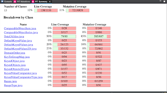
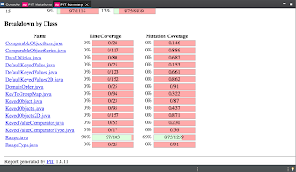

**SENG 438 - Software Testing, Reliability, and Quality**

**Lab. Report \#4 – Mutation Testing and Web app testing**

| Group \#:       |  37 |
|-----------------|---|
| Student Names:  |  Dominic Vandekerkhove |
|                 |  Alexander Varga       |
|                 |  Ivan Tompong          |
|                 |  John Cedric Acierto   |

# Introduction
The purpose of this lab is to further enhance our test suite from labs 2 and 3 by performing mutation testing and to gain experience and familiarize ourselves with GUI based testing. The system under test is still JFreeChart. We will be creating faulty versions of the SUT and running our test suite to ensure the mutants are accurately distinguishable. We will gain experience with mutation testing and will be able to measure the mutation score of our test suite using PiTest. The second portion of this lab consists of GUI based testing with Selenium IDE. The SUT will be the Walmart page and we will be automating a number of test cases to record the functionality of the web page. 

# Analysis of 10 Mutants of the Range class 
90 Less or equal to equal: This mutant changes the condition on line 90 from a “less than or equal to” comparison to an equal comparison. The line is changed in the range constructor Range(double upper, double lower) and allows for improper instantiation of the lower and upper boundaries of the range. This mutant is killed by a test we created that attempts to create a range with a lower boundary greater than the upper boundary. This test expects an exception to be thrown and since the mutant does not throw the exception, the test fails and the mutant is killed.

123 Replaced double subtraction: This mutant changes the operation on line 123 from subtraction to addition. This effectively returns the improper value for the length() method. This mutant is killed by a test that creates a Range and tests the length() method. Since the mutant adds the boundary values rather than determining the difference, the incorrect value is returned, causing the test to fail. 

132 Replaced 2.0 with -1.0: This mutant changes the value of 2.0 in the statement “this.lower/2.0” to -1.0 when computing the central value in the getCentralValue() method. This mutant is killed by a test that calls getCentralValue() with a precalculated expected value. Changing the value of 2.0 causes the method to produce an incorrect output, which is caught by this test, killing the mutant. 

144 Less than to less or equal: This mutant changes the condition from less than to less or equal. This is in regard to the contains(double value) function when computing value>=this.lower. This mutant is not caught by our test suite as we have no tests that test a value less than the lower bound. A test with inputs value=5 and Range=[10, 15] would kill this mutant.

90 removed conditional - replaced comparison check with true: This mutation removes the comparison on line 90 of Range completely and replaces it with true. By changing the condition from a comparison to just true guarantees that when a Range object is instantiated and the constructor is called, an IllegalArgumentException will always be thrown. This mutation is caught and killed by a test case called testNegativeScale(). The test case expects an IllegalArgumentException to be thrown, so when the Range object that in the test case is instantiated, the IllegalArgumentException thrown by the mutant is caught, killing the mutant

105 Negated double field lower: This mutation negates the variable called lower (i.e., it multiplies it by -1) on line 105 of the Range class. By negating the ‘lower’ variable, the function getLowerBound() will not return the actual lower bound of the Range object but instead returns the negated version of the lower bound. The test cases that caught the mutation would be the test cases called testPositiveGetLowerBound() and testNegativeGetLowerBound(), which are specifically designed to test if the function getLowerBound() returns the correct lower bound value. Since the getLowerBoundValue in this mutation returns a negated version of the lower bound, it is immediately caught and killed by the two test cases mentioned.

123 Replaced double subtraction with multiplication: This mutation replaces the subtraction operation with a multiplication in line 123 of the Range class. When the getLength() method is called, instead of returning the length of the range, the function instead returns the product of the lower and upper bounds of the range. This mutation is killed by the test case called testGetRangeLength(). The test case instantiates a Range object with a range of (0, 10) and then calls the getLength() method which, if working properly should return 10, but since the mutant contains a multiplication instead of a subtraction, the method returns a value of 10 because 10 times 0 equals 0.

247 Negated Conditional: This mutant negates the condition found on line 247 of the Range class. When the argument of the combineIgnoringNaN() method called range2 is set to null, it skips past the if statement that is supposed to handle the case when range2 is null. This mutation is a stillborn mutant because it is syntactically incorrect since the min() method for Java does not allow for null inputs.

157 Changed conditional boundary: This mutant changes the conditional boundary on line 157 of the Range class. When changing the conditional boundary for this function, the set of values that makes the condition true changes as well. The original test suite did not have sufficient test cases to kill this mutant. 

176 Removed call to intersects(): This mutant removed the call to the intersects() method in line 176 of the Range class, within the intersects() method. By removing the call to intersects() within this redefined method, the test cases are unable to verify whether the code is correct. This mutant can be killed by any of the test cases designed in the original suite. 

# Report all the statistics and the mutation score for each test class
DataUtilitiesTest Mutation Score

RangeTest Mutation Score

# Analysis drawn on the effectiveness of each of the test classes
From the recorded mutation scores above, it is clear that our DataUtilities test class has a higher mutation score. Although our RangeTest class kills more mutants than our DataUtilitiesTest class, the Range class had almost twice as many mutants as the DataUtilities class. That being said, the Range class is logic and calculation based, resulting in many combinations of alterations to the source code. In both classes, tests were written based on statement and branch coverage, so, many mutants that involved multiple conditions survived since we never tested specific conditions, but rather overall branching structure. 

# A discussion on the effect of equivalent mutants on mutation score accuracy
Equivalent mutants skew mutation scores as they are intended to survive yet do not indicate an inconsistency with the tests. If a class contains mutants logically equivalent to the source code, a perfect test suite that covers all possible mutants will not have 100% coverage as the equivalent mutants will always survive. 

# A discussion of what could have been done to improve the mutation score of the test suites
To improve our test suite, we have to write more tests that involve testing single conditions in the source code. Both classes contained instances where an if statement is supplied with multiple conditions. Since mutants were created changing each individual condition, our tests failed to kill them. Ultimately, we have to analyze the source code further and create tests exercising every possible combination of equivalent inputs. 

# Why do we need mutation testing? Advantages and disadvantages of mutation testing
The goal of mutation testing is to detect changes in the software. This allows testers to measure how good their test suite is and also allows developers to test their software for redundant pieces of code. A major problem with mutation testing is that it does not necessarily test code functionality. As well, with pitest, it requires that all code is fixed before you can run any mutation testing. So, mutation testing cannot be conducted while parts of the code are undergoing unit testing. 

# Explain your SELENUIM test case design process
First, we explored the walmart page to determine its functionalities and the expected UI. With this information, we developed tests for each functionality with a variety of inputs based on expected user interaction and invalid arguments. 

# Explain the use of assertions and checkpoints
Assertions and checkpoints are used to ensure the web page produces the correct elements after certain actions are taken. They are used similarly to unit test assertions as they compare expected outputs with actual program outputs. The significant difference is that assertions in GUI based testing accept a number of commands as inputs and assert a specific element exists on the resulting page.

# how did you test each functionaity with different test data
Search: Two tests were conducted on the search functionality. The first test inputs a valid string into the search bar “chair” and presses enter to search. The test then asserts that the menu bar displaying the different categories of chairs appears along with the list of available chairs. This test is called Search Function. The second test attempts to search for an invalid item “sdfajsdflaj” and expects the “Sorry, your item could not be found” error page. This test is called Invalid Search.

Price Sorting: Two tests were conducted on the price sorting function. The first test called Price Category tests changing the price range from 0-50 while searching for a chair. The test asserts that correct elements appear after each action. The second test called Invalid Price tests a price range from 10 to 1 and asserts that the proper error message is displayed. 

Shopping Cart: Two tests were conducted on the shopping cart route/functionality. The first test called ShoppingCartEmpty tests that when entering the website if a user clicks on the shopping cart icon they will be directed to an empty shopping cart. This test asserts that certain elements are present. The second test is called ShoppingCart2Items where the user's walmart cart has 2 items in it and we assert that when in the /cart router there are two items/elements.

Popularity Filter: Two tests were conducted on the filter functionality specifically testing outputs of the “Popular” category. The first test called FilterTopRated searches for a microwave and applies the popularity filter to the search query. It asserts that the most popular microwave that Walmart sells is present in position. (Galanz ExpressWave 1.3 Cu.Ft Sensor Cooking Microwave Oven, Stainless Steel | Walmart Canada). The second test called FilterPanasonic follows the same procedure as above but filters out all the microwaves that are not panasonic and the test asserts that only panasonic microwave elements are present.

Store Finder: There were two tests conducted on the Store Finder functionality. One test uses a specific store name, Walmart Supercentre Royal Oak, as an input and the other uses a ZIP code, T3G 5T4, which is the ZIP code for the Walmart Supercentre at Royal Oak. The first test case takes a specific store location and then navigates to the webpage containing the store information. The second test case does the exact same thing, but this time it uses the ZIP code of the same store to see if it produces the same output as the first test case.

Sign-In/Join: Two tests were performed on this functionality, making sure that it navigates to the correct page. The first test performed navigates towards the Sign-In page and asserts that the Sign In to your account form is present on the page. The second test navigates towards the Join and asserts that the Create an Account form is present on the webpage

Email Subscription: Two tests were performed on this functionality. One test focuses on sending a valid email address, and the other test has an invalid input. On the valid test case, assertion is made that the message “Thank you! You are now subscribed to the Walmart newsletter.” would appear. On the invalid test case, assertion is made that an invalid email message would show up. 

Grocery Aisle: Two tests were performed for this functionality. One case asserts that the message “Buy fresh fruits & vegetables online” when clicking on the Fruits and Vegetables section. The second case asserts that the message “Fresh dairy products & eggs” shows up when clicking the Dairy & eggs section. 

# Discuss advantages and disadvantages of Selenium vs. Sikulix
The first major difference between the two programs is their accessibility. Selenium seems to be a far more popular tool as it is offered as a google chrome extension and is very easy and straightforward to download. Sikulix on the other hand must be downloaded as a jar file through the website and then executed through the command line. It also requires you to configure your computer permissions for it to work properly. As testing tools, selenium offers a far more extensive platform that allows you to assert specific elements and check for certain values after applying an array of commands. Sikulix on the other hand is largely image based and allows testers to see the exact page that was output, rather than asserting specific elements exist. Ultimately, Selenium is a better tool for in-depth GUI testing while Sikulix is used on a much lower level.

# How the team work/effort was divided and managed
For the first portion of the assignment, each team member developed tests that contributed at least 3% to the mutation score. This guaranteed that our new score was more than 10% above the original score from assignment 3. For the GUI-based testing, each team member chose 2 functionalities from the Walmart website and conducted selenium tests to ensure each function fulfilled its proper functionality. 

# Difficulties encountered, challenges overcome, and lessons learned
Setting up Pitclipse and having it work was an early but easy obstacle to overcome. The main issues that were associated with Pitclipse was installation from the Eclipse Marketplace and having it perform the mutation testing on our test suite; these issues were solved by using alternative methods of installation and fixing our test suite such that all of our test cases pass.

Some difficulties were encountered with Selenium IDE. While using Selenium IDE, browser performance becomes much slower and during testing of some functionalities, Selenium IDE will perform the incorrect steps. Another difficulty working with Selenium IDE was that it used a lot of memory from the system. Some of the members’ computers were unable to render the complete functionality of the walmart page while operating selenium. As a result, we had a limited selection of functionalities to test. Another problem was derived from the Walmart homepage. Since the site was subject to pop-ups with ads and asking users to log in, selenium tests often failed since the elements we reference were covered by these pop-ups. 

# Comments/feedback on the lab itself
This lab provided a great opportunity to gain experience with both mutation testing and GUI-based testing. We were able to familiarize ourselves with the Pitest mutation testing tool as well as the selenium IDE to conduct GUI-based testing. 
